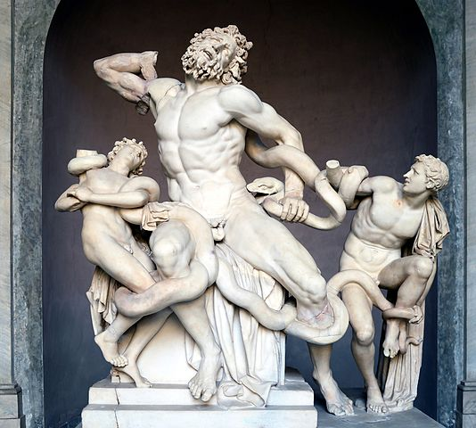

# svg-sketch

This is a sandbox/playground to test out svg sketching ideas. It is _not_ production quality or even good code. I have bodged much.

It takes:

and turns it into:

__Crosshatched:__

__Weighted:__

It is inspired by [this post](https://www.reddit.com/r/proceduralgeneration/comments/e72srp/procedurally_generated_crosshatching/) by [u/roboticrabbitsmasher](https://www.reddit.com/user/roboticrabbitsmasher/), who produces the same kind of crosshatching on an XY plotter whereas this just outputs SVG.